# Work Breakdown Structure (WBS) Chart

## PinePix Project WBS

```mermaid
graph TD
    A[PinePix Project] --> B[1.0 Project Planning & Setup]
    A --> C[2.0 Core Development]
    A --> D[3.0 Integration & APIs]
    A --> E[4.0 UI/UX Development]
    A --> F[5.0 Testing & Quality Assurance]
    A --> G[6.0 Deployment & Documentation]
    A --> H[7.0 Project Closure]
    
    B --> B1[1.1 Requirements gathering]
    B --> B2[1.2 Technology stack selection]
    B --> B3[1.3 Database schema design]
    B --> B4[1.4 Project environment setup]
    B --> B5[1.5 Development tools configuration]
    
    C --> C1[2.1 Authentication Module]
    C --> C2[2.2 User Management Module]
    C --> C3[2.3 Farm Management Module]
    C --> C4[2.4 Shop Management Module]
    C --> C5[2.5 Announcements Module]
    C --> C6[2.6 AI Chatbot Module]
    C --> C7[2.7 Public Landing Page]
    C --> C8[2.8 Admin Panel]
    
    C1 --> C1A[2.1.1 Login system]
    C1 --> C1B[2.1.2 Registration with SSM validation]
    C1 --> C1C[2.1.3 Password reset]
    C1 --> C1D[2.1.4 Approval workflow]
    
    C2 --> C2A[2.2.1 Biodata management]
    C2 --> C2B[2.2.2 Profile image upload]
    C2 --> C2C[2.2.3 Social links management]
    C2 --> C2D[2.2.4 Admin user management]
    
    C3 --> C3A[2.3.1 Farm CRUD operations]
    C3 --> C3B[2.3.2 Multiple image upload]
    C3 --> C3C[2.3.3 Google Maps integration]
    C3 --> C3D[2.3.4 Leaflet.js map]
    
    C4 --> C4A[2.4.1 Shop CRUD operations]
    C4 --> C4B[2.4.2 Operating hours]
    C4 --> C4C[2.4.3 Map integration]
    C4 --> C4D[2.4.4 Multiple image support]
    
    C5 --> C5A[2.5.1 Announcement CRUD]
    C5 --> C5B[2.5.2 Multiple types]
    C5 --> C5C[2.5.3 Image upload]
    C5 --> C5D[2.5.4 Public/Private views]
    
    C6 --> C6A[2.6.1 FAQ knowledge base]
    C6 --> C6B[2.6.2 Gemini API integration]
    C6 --> C6C[2.6.3 Chat history logging]
    C6 --> C6D[2.6.4 Role-based access]
    
    C7 --> C7A[2.7.1 Hero section]
    C7 --> C7B[2.7.2 Interactive map]
    C7 --> C7C[2.7.3 Latest announcements]
    C7 --> C7D[2.7.4 Statistics dashboard]
    
    C8 --> C8A[2.8.1 Entrepreneur approval]
    C8 --> C8B[2.8.2 FAQ management]
    C8 --> C8C[2.8.3 System settings]
    C8 --> C8D[2.8.4 Statistics and reports]
    
    D --> D1[3.1 Google Maps Places API]
    D --> D2[3.2 Google Gemini API]
    D --> D3[3.3 Price scraping system]
    D --> D4[3.4 Email service SMTP]
    
    E --> E1[4.1 Responsive design]
    E --> E2[4.2 Bootstrap 5 customization]
    E --> E3[4.3 Dark mode support]
    E --> E4[4.4 Interactive components]
    E --> E5[4.5 Mobile-first design]
    
    F --> F1[5.1 Unit testing]
    F --> F2[5.2 Integration testing]
    F --> F3[5.3 User acceptance testing]
    F --> F4[5.4 Security testing]
    F --> F5[5.5 Performance testing]
    
    G --> G1[6.1 Production environment]
    G --> G2[6.2 Database migration]
    G --> G3[6.3 User documentation]
    G --> G4[6.4 Technical documentation]
    G --> G5[6.5 Deployment guide]
    
    H --> H1[7.1 Final testing]
    H --> H2[7.2 Demo video preparation]
    H --> H3[7.3 Project presentation]
    H --> H4[7.4 Lessons learned]
    
    style A fill:#f59e0b,stroke:#d97706,stroke-width:3px,color:#fff
    style B fill:#3b82f6,stroke:#2563eb,stroke-width:2px,color:#fff
    style C fill:#10b981,stroke:#059669,stroke-width:2px,color:#fff
    style D fill:#8b5cf6,stroke:#7c3aed,stroke-width:2px,color:#fff
    style E fill:#ec4899,stroke:#db2777,stroke-width:2px,color:#fff
    style F fill:#f97316,stroke:#ea580c,stroke-width:2px,color:#fff
    style G fill:#06b6d4,stroke:#0891b2,stroke-width:2px,color:#fff
    style H fill:#84cc16,stroke:#65a30d,stroke-width:2px,color:#fff
```



## WBS Hierarchy (Text Format)

```
PinePix Project
│
├── 1.0 Project Planning & Setup
│   ├── 1.1 Requirements gathering and analysis
│   ├── 1.2 Technology stack selection
│   ├── 1.3 Database schema design
│   ├── 1.4 Project environment setup
│   └── 1.5 Development tools configuration
│
├── 2.0 Core Development
│   ├── 2.1 Authentication Module
│   │   ├── 2.1.1 Login system
│   │   ├── 2.1.2 Registration with SSM validation
│   │   ├── 2.1.3 Password reset functionality
│   │   └── 2.1.4 Approval workflow implementation
│   │
│   ├── 2.2 User Management Module
│   │   ├── 2.2.1 Biodata management
│   │   ├── 2.2.2 Profile image upload
│   │   ├── 2.2.3 Social links management
│   │   └── 2.2.4 Admin user management
│   │
│   ├── 2.3 Farm Management Module
│   │   ├── 2.3.1 Farm CRUD operations
│   │   ├── 2.3.2 Multiple image upload
│   │   ├── 2.3.3 Google Maps integration
│   │   └── 2.3.4 Leaflet.js map implementation
│   │
│   ├── 2.4 Shop Management Module
│   │   ├── 2.4.1 Shop CRUD operations
│   │   ├── 2.4.2 Operating hours configuration
│   │   ├── 2.4.3 Map integration
│   │   └── 2.4.4 Multiple image support
│   │
│   ├── 2.5 Announcements Module
│   │   ├── 2.5.1 Announcement CRUD operations
│   │   ├── 2.5.2 Multiple announcement types
│   │   ├── 2.5.3 Image upload functionality
│   │   └── 2.5.4 Public/Private views
│   │
│   ├── 2.6 AI Chatbot Module
│   │   ├── 2.6.1 FAQ knowledge base system
│   │   ├── 2.6.2 Gemini API integration
│   │   ├── 2.6.3 Chat history logging
│   │   └── 2.6.4 Role-based access control
│   │
│   ├── 2.7 Public Landing Page
│   │   ├── 2.7.1 Hero section design
│   │   ├── 2.7.2 Interactive map with clusters
│   │   ├── 2.7.3 Latest announcements display
│   │   └── 2.7.4 Statistics dashboard
│   │
│   └── 2.8 Admin Panel
│       ├── 2.8.1 Entrepreneur approval system
│       ├── 2.8.2 FAQ management
│       ├── 2.8.3 System settings
│       └── 2.8.4 Statistics and reports
│
├── 3.0 Integration & APIs
│   ├── 3.1 Google Maps Places API integration
│   ├── 3.2 Google Gemini API integration
│   ├── 3.3 Price scraping system
│   └── 3.4 Email service (SMTP) integration
│
├── 4.0 UI/UX Development
│   ├── 4.1 Responsive design implementation
│   ├── 4.2 Bootstrap 5 customization
│   ├── 4.3 Dark mode support
│   ├── 4.4 Interactive components (DataTables, SweetAlert2)
│   └── 4.5 Mobile-first responsive design
│
├── 5.0 Testing & Quality Assurance
│   ├── 5.1 Unit testing
│   ├── 5.2 Integration testing
│   ├── 5.3 User acceptance testing
│   ├── 5.4 Security testing
│   └── 5.5 Performance testing
│
├── 6.0 Deployment & Documentation
│   ├── 6.1 Production environment setup
│   ├── 6.2 Database migration
│   ├── 6.3 User documentation
│   ├── 6.4 Technical documentation
│   └── 6.5 Deployment guide
│
└── 7.0 Project Closure
    ├── 7.1 Final testing and bug fixes
    ├── 7.2 Demo video preparation
    ├── 7.3 Project presentation
    └── 7.4 Lessons learned documentation
```

