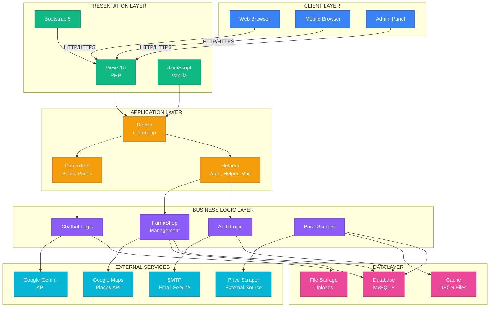

# System Architecture Diagram

## PinePix Technical Architecture



## System Architecture (Text Format)

```
┌─────────────────────────────────────────────────────────────┐
│                        CLIENT LAYER                          │
│  ┌──────────────┐  ┌──────────────┐  ┌──────────────┐     │
│  │   Web Browser │  │ Mobile Browser│  │  Admin Panel │     │
│  └──────────────┘  └──────────────┘  └──────────────┘     │
└─────────────────────────────────────────────────────────────┘
                            │
                            │ HTTP/HTTPS
                            │
┌─────────────────────────────────────────────────────────────┐
│                    PRESENTATION LAYER                       │
│  ┌──────────────┐  ┌──────────────┐  ┌──────────────┐     │
│  │   Views/UI   │  │  JavaScript  │  │   Bootstrap  │     │
│  │   (PHP)      │  │   (Vanilla)  │  │      5       │     │
│  └──────────────┘  └──────────────┘  └──────────────┘     │
└─────────────────────────────────────────────────────────────┘
                            │
                            │
┌─────────────────────────────────────────────────────────────┐
│                     APPLICATION LAYER                       │
│  ┌──────────────┐  ┌──────────────┐  ┌──────────────┐     │
│  │   Router     │  │   Helpers    │  │   Controllers│     │
│  │  (router.php)│  │  (Auth, etc) │  │   (Public)   │     │
│  └──────────────┘  └──────────────┘  └──────────────┘     │
└─────────────────────────────────────────────────────────────┘
                            │
                            │
┌─────────────────────────────────────────────────────────────┐
│                      BUSINESS LOGIC LAYER                   │
│  ┌──────────────┐  ┌──────────────┐  ┌──────────────┐     │
│  │  Auth Logic  │  │  Farm/Shop   │  │  Chatbot     │     │
│  │              │  │  Management  │  │  Logic       │     │
│  └──────────────┘  └──────────────┘  └──────────────┘     │
└─────────────────────────────────────────────────────────────┘
                            │
                            │
┌─────────────────────────────────────────────────────────────┐
│                        DATA LAYER                            │
│  ┌──────────────┐  ┌──────────────┐  ┌──────────────┐     │
│  │   Database   │  │   File       │  │   Cache      │     │
│  │   (MySQL 8)  │  │   Storage    │  │   (JSON)     │     │
│  └──────────────┘  └──────────────┘  └──────────────┘     │
└─────────────────────────────────────────────────────────────┘
                            │
                            │
┌─────────────────────────────────────────────────────────────┐
│                    EXTERNAL SERVICES                         │
│  ┌──────────────┐  ┌──────────────┐  ┌──────────────┐     │
│  │ Google Maps  │  │ Google Gemini│  │ Price Scraper│     │
│  │ Places API   │  │     API      │  │  (External)  │     │
│  └──────────────┘  └──────────────┘  └──────────────┘     │
└─────────────────────────────────────────────────────────────┘
```

