# Database Architecture (ERD)

## Entity Relationship Diagram

```mermaid
erDiagram
    USERS ||--o{ FARMS : "has"
    USERS ||--o{ SHOPS : "has"
    USERS ||--o{ ANNOUNCEMENTS : "creates"
    USERS ||--|| SOCIAL_LINKS : "has"
    USERS ||--o{ CHAT_LOGS : "creates"
    USERS ||--o| USERS : "approves"
    
    USERS {
        int id PK
        enum role
        string name
        string email UK
        string password_hash
        string phone
        text address
        string gender
        string ic_passport
        string profile_image
        string business_category
        string ssm_no
        string ssm_document
        enum approval_status
        text rejection_reason
        int approved_by FK
        datetime approved_at
        boolean first_login_completed
        boolean email_verified
        string reset_token
        datetime reset_token_expiry
        datetime created_at
        datetime updated_at
    }
    
    FARMS {
        int id PK
        int user_id FK
        string farm_name
        string farm_size
        text address
        decimal latitude
        decimal longitude
        text images
        datetime created_at
        datetime updated_at
    }
    
    SHOPS {
        int id PK
        int user_id FK
        string shop_name
        text address
        decimal latitude
        decimal longitude
        string operation_hours
        string contact
        text images
        datetime created_at
        datetime updated_at
    }
    
    ANNOUNCEMENTS {
        int id PK
        string title
        enum type
        text description
        string image
        text images
        int created_by FK
        datetime created_at
        datetime updated_at
    }
    
    SOCIAL_LINKS {
        int id PK
        int user_id FK
        string facebook
        string instagram
        string tiktok
        string website
        string shopee
        string lazada
        datetime created_at
        datetime updated_at
    }
    
    FAQ_KNOWLEDGE {
        int id PK
        text question
        text answer
        datetime created_at
        datetime updated_at
    }
    
    CHAT_LOGS {
        int id PK
        int user_id FK
        text message
        text response
        enum mode
        datetime created_at
    }
    
    SETTINGS {
        int id PK
        string setting_key UK
        text setting_value
        datetime created_at
        datetime updated_at
    }
    
    PINEAPPLE_PRICES {
        int id PK
        decimal price
        string unit
        int week
        int year
        string update_date
        string source
        text data_sources
        text state_averages
        text state_lowest
        datetime created_at
    }
    
    PINEAPPLE_STATE_AVERAGES {
        int id PK
        int price_id FK
        string state
        decimal average_price
        string price_change
        string percent_change
        datetime created_at
    }
    
    PINEAPPLE_STATE_LOWEST {
        int id PK
        int price_id FK
        string state
        string shop
        string date
        decimal price
        datetime created_at
    }
    
    PINEAPPLE_PRICES ||--o{ PINEAPPLE_STATE_AVERAGES : "has"
    PINEAPPLE_PRICES ||--o{ PINEAPPLE_STATE_LOWEST : "has"
```

## Database Relationships Summary

### Core Relationships:
1. **Users → Farms** (One-to-Many)
   - One user can have multiple farms
   - Cascade delete: When user is deleted, farms are deleted

2. **Users → Shops** (One-to-Many)
   - One user can have multiple shops
   - Cascade delete: When user is deleted, shops are deleted

3. **Users → Announcements** (One-to-Many)
   - One user can create multiple announcements
   - Set null on delete: Announcements remain but creator is null

4. **Users → Social Links** (One-to-One)
   - One user has one social links record
   - Cascade delete: When user is deleted, social links are deleted

5. **Users → Chat Logs** (One-to-Many)
   - One user can have multiple chat logs
   - Set null on delete: Chat logs remain but user_id is null

6. **Users → Users** (Self-referential)
   - approved_by references users.id
   - Used for tracking which admin approved an entrepreneur

7. **Pineapple Prices → State Averages** (One-to-Many)
   - One price record can have multiple state averages
   - Cascade delete: When price is deleted, state averages are deleted

8. **Pineapple Prices → State Lowest** (One-to-Many)
   - One price record can have multiple state lowest prices
   - Cascade delete: When price is deleted, state lowest are deleted

## Database Tables Overview

| Table Name | Purpose | Key Fields |
|------------|---------|------------|
| users | User accounts and profiles | id, email, role, approval_status |
| farms | Farm information | id, user_id, farm_name, latitude, longitude |
| shops | Shop information | id, user_id, shop_name, operation_hours |
| announcements | Announcements content | id, type, title, created_by |
| social_links | Social media links | id, user_id, facebook, instagram, etc. |
| faq_knowledge | FAQ for chatbot | id, question, answer |
| chat_logs | Chat history | id, user_id, message, response, mode |
| settings | System configuration | id, setting_key, setting_value |
| pineapple_prices | Price tracking | id, price, week, year, source |
| pineapple_state_averages | State average prices | id, price_id, state, average_price |
| pineapple_state_lowest | State lowest prices | id, price_id, state, shop, price |

