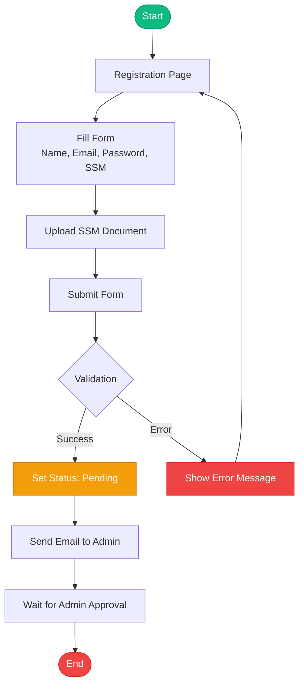
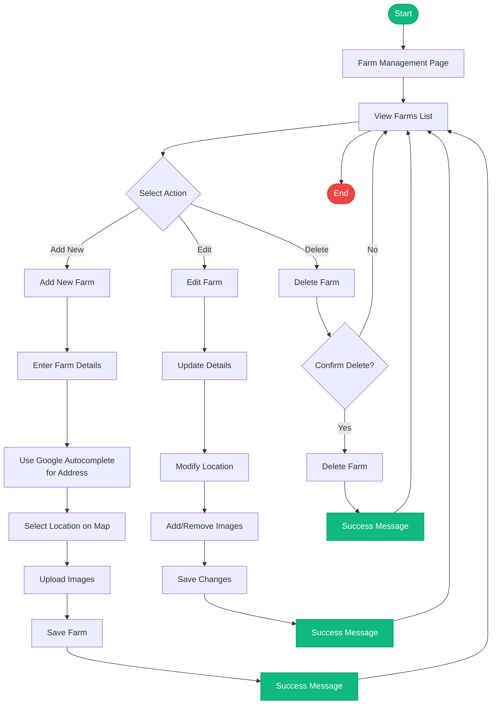
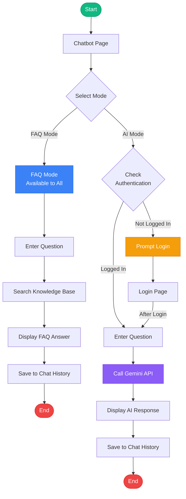
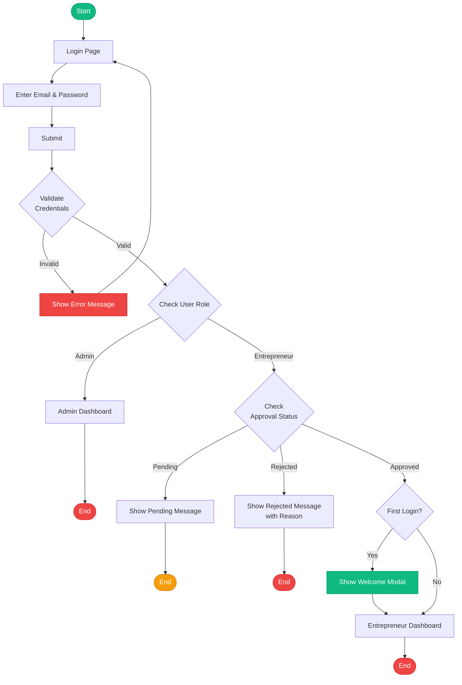
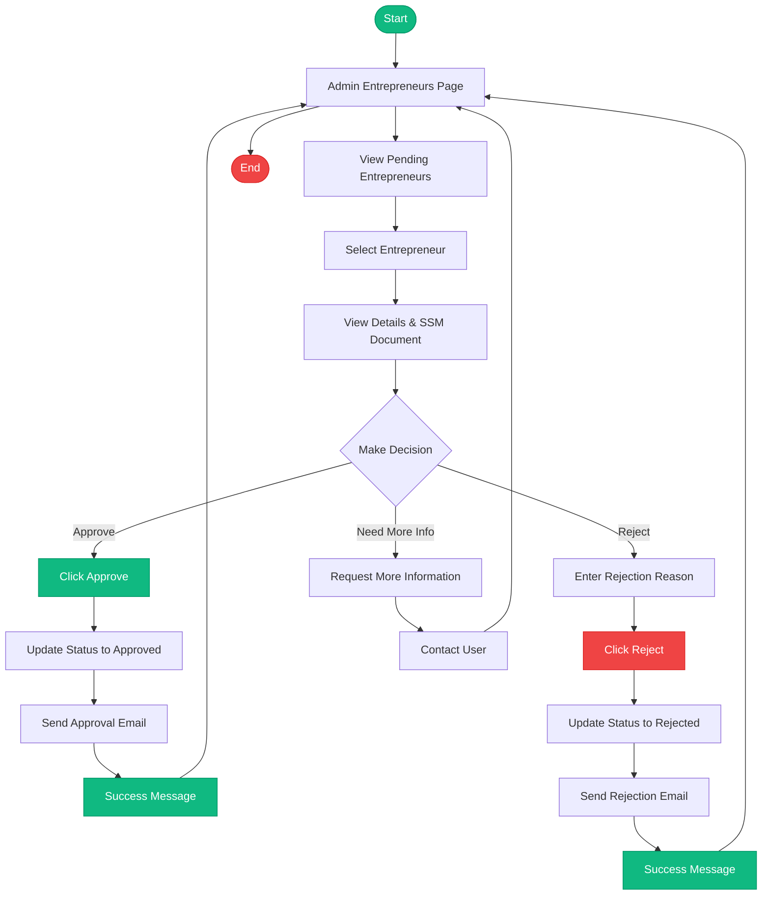

# User Flow Diagrams

## 1. Registration Flow

```mermaid
flowchart TD
    Start([Start]) --> RegPage[Registration Page]
    RegPage --> FillForm[Fill Form<br/>Name, Email, Password, SSM]
    FillForm --> UploadSSM[Upload SSM Document]
    UploadSSM --> Submit[Submit Form]
    Submit --> Validate{Validation}
    Validate -->|Success| SetPending[Set Status: Pending]
    Validate -->|Error| ShowError[Show Error Message]
    SetPending --> SendEmail[Send Email to Admin]
    SendEmail --> WaitApproval[Wait for Admin Approval]
    WaitApproval --> End1([End])
    ShowError --> RegPage
    End1
    
    style Start fill:#10b981,stroke:#059669,color:#fff
    style End1 fill:#ef4444,stroke:#dc2626,color:#fff
    style SetPending fill:#f59e0b,stroke:#d97706,color:#fff
    style ShowError fill:#ef4444,stroke:#dc2626,color:#fff
```

## 2. Farm Management Flow

```mermaid
flowchart TD
    Start([Start]) --> FarmPage[Farm Management Page]
    FarmPage --> ViewList[View Farms List]
    ViewList --> Action{Select Action}
    
    Action -->|Add New| AddFarm[Add New Farm]
    Action -->|Edit| EditFarm[Edit Farm]
    Action -->|Delete| DeleteFarm[Delete Farm]
    
    AddFarm --> EnterDetails[Enter Farm Details]
    EnterDetails --> GoogleAuto[Use Google Autocomplete<br/>for Address]
    GoogleAuto --> SelectMap[Select Location on Map]
    SelectMap --> UploadImg[Upload Images]
    UploadImg --> Save[Save Farm]
    Save --> Success1[Success Message]
    Success1 --> ViewList
    
    EditFarm --> UpdateDetails[Update Details]
    UpdateDetails --> ModifyLoc[Modify Location]
    ModifyLoc --> ManageImg[Add/Remove Images]
    ManageImg --> SaveChanges[Save Changes]
    SaveChanges --> Success2[Success Message]
    Success2 --> ViewList
    
    DeleteFarm --> Confirm{Confirm Delete?}
    Confirm -->|Yes| Delete[Delete Farm]
    Confirm -->|No| ViewList
    Delete --> Success3[Success Message]
    Success3 --> ViewList
    
    ViewList --> End([End])
    
    style Start fill:#10b981,stroke:#059669,color:#fff
    style End fill:#ef4444,stroke:#dc2626,color:#fff
    style Success1 fill:#10b981,stroke:#059669,color:#fff
    style Success2 fill:#10b981,stroke:#059669,color:#fff
    style Success3 fill:#10b981,stroke:#059669,color:#fff
```

## 3. Chatbot Flow

```mermaid
flowchart TD
    Start([Start]) --> ChatPage[Chatbot Page]
    ChatPage --> SelectMode{Select Mode}
    
    SelectMode -->|FAQ Mode| FAQMode[FAQ Mode<br/>Available to All]
    SelectMode -->|AI Mode| CheckAuth{Check<br/>Authentication}
    
    FAQMode --> EnterQ1[Enter Question]
    EnterQ1 --> SearchKB[Search Knowledge Base]
    SearchKB --> DisplayFAQ[Display FAQ Answer]
    DisplayFAQ --> SaveHistory1[Save to Chat History]
    SaveHistory1 --> End1([End])
    
    CheckAuth -->|Logged In| EnterQ2[Enter Question]
    CheckAuth -->|Not Logged In| PromptLogin[Prompt Login]
    PromptLogin --> LoginPage[Login Page]
    LoginPage -->|After Login| EnterQ2
    
    EnterQ2 --> CallGemini[Call Gemini API]
    CallGemini --> DisplayAI[Display AI Response]
    DisplayAI --> SaveHistory2[Save to Chat History]
    SaveHistory2 --> End2([End])
    
    style Start fill:#10b981,stroke:#059669,color:#fff
    style End1 fill:#ef4444,stroke:#dc2626,color:#fff
    style End2 fill:#ef4444,stroke:#dc2626,color:#fff
    style FAQMode fill:#3b82f6,stroke:#2563eb,color:#fff
    style CallGemini fill:#8b5cf6,stroke:#7c3aed,color:#fff
    style PromptLogin fill:#f59e0b,stroke:#d97706,color:#fff
```

## 4. Login Flow

```mermaid
flowchart TD
    Start([Start]) --> LoginPage[Login Page]
    LoginPage --> EnterCred[Enter Email & Password]
    EnterCred --> Submit[Submit]
    Submit --> Validate{Validate<br/>Credentials}
    
    Validate -->|Invalid| ShowError[Show Error Message]
    ShowError --> LoginPage
    
    Validate -->|Valid| CheckRole{Check User Role}
    CheckRole -->|Admin| AdminDash[Admin Dashboard]
    CheckRole -->|Entrepreneur| CheckStatus{Check<br/>Approval Status}
    
    CheckStatus -->|Pending| ShowPending[Show Pending Message]
    CheckStatus -->|Rejected| ShowRejected[Show Rejected Message<br/>with Reason]
    CheckStatus -->|Approved| CheckFirst{First Login?}
    
    CheckFirst -->|Yes| ShowWelcome[Show Welcome Modal]
    CheckFirst -->|No| EntDash[Entrepreneur Dashboard]
    ShowWelcome --> EntDash
    
    AdminDash --> End1([End])
    EntDash --> End2([End])
    ShowPending --> End3([End])
    ShowRejected --> End4([End])
    
    style Start fill:#10b981,stroke:#059669,color:#fff
    style End1 fill:#ef4444,stroke:#dc2626,color:#fff
    style End2 fill:#ef4444,stroke:#dc2626,color:#fff
    style End3 fill:#f59e0b,stroke:#d97706,color:#fff
    style End4 fill:#ef4444,stroke:#dc2626,color:#fff
    style ShowError fill:#ef4444,stroke:#dc2626,color:#fff
    style ShowWelcome fill:#10b981,stroke:#059669,color:#fff
```

## 5. Admin Approval Flow

```mermaid
flowchart TD
    Start([Start]) --> AdminPage[Admin Entrepreneurs Page]
    AdminPage --> ViewPending[View Pending Entrepreneurs]
    ViewPending --> SelectEnt[Select Entrepreneur]
    SelectEnt --> ViewDetails[View Details & SSM Document]
    ViewDetails --> Decision{Make Decision}
    
    Decision -->|Approve| Approve[Click Approve]
    Decision -->|Reject| EnterReason[Enter Rejection Reason]
    Decision -->|Need More Info| RequestInfo[Request More Information]
    
    Approve --> UpdateStatus[Update Status to Approved]
    UpdateStatus --> SendApprovalEmail[Send Approval Email]
    SendApprovalEmail --> Success1[Success Message]
    Success1 --> AdminPage
    
    EnterReason --> Reject[Click Reject]
    Reject --> UpdateRejected[Update Status to Rejected]
    UpdateRejected --> SendRejectEmail[Send Rejection Email]
    SendRejectEmail --> Success2[Success Message]
    Success2 --> AdminPage
    
    RequestInfo --> ContactUser[Contact User]
    ContactUser --> AdminPage
    
    AdminPage --> End([End])
    
    style Start fill:#10b981,stroke:#059669,color:#fff
    style End fill:#ef4444,stroke:#dc2626,color:#fff
    style Approve fill:#10b981,stroke:#059669,color:#fff
    style Reject fill:#ef4444,stroke:#dc2626,color:#fff
    style Success1 fill:#10b981,stroke:#059669,color:#fff
    style Success2 fill:#10b981,stroke:#059669,color:#fff
```

