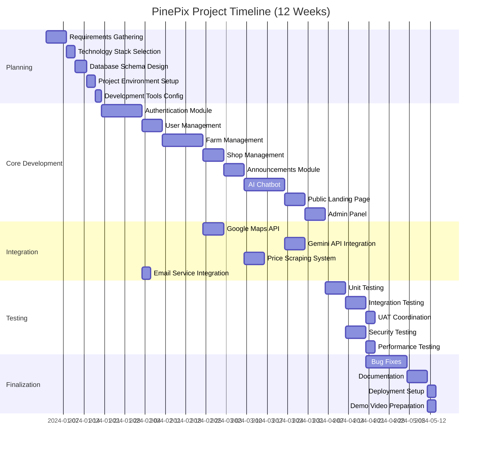

# Gantt Chart - Project Timeline

## PinePix Project Gantt Chart



## Gantt Chart (Text Format)

```
Task                    │ Week 1│ Week 2│ Week 3│ Week 4│ Week 5│ Week 6│ Week 7│ Week 8│ Week 9│ Week 10│ Week 11│ Week 12│
────────────────────────┼───────┼───────┼───────┼───────┼───────┼───────┼───────┼───────┼───────┼────────┼────────┼────────┤
Planning & Design       │███████│███████│       │       │       │       │       │       │       │        │        │        │
Database Design         │       │███████│       │       │       │       │       │       │       │        │        │        │
Auth Module             │       │       │███████│███████│       │       │       │       │       │        │        │        │
User Management         │       │       │       │███████│       │       │       │       │       │        │        │        │
Farm Management         │       │       │       │       │███████│███████│       │       │       │        │        │        │
Shop Management         │       │       │       │       │       │███████│       │       │       │        │        │        │
Announcements           │       │       │       │       │       │       │███████│       │       │        │        │        │
AI Chatbot              │       │       │       │       │       │       │███████│███████│       │        │        │        │
Public Landing          │       │       │       │       │       │       │       │███████│       │        │        │        │
Admin Panel             │       │       │       │       │       │       │       │███████│       │        │        │        │
API Integrations        │       │       │       │       │       │       │███████│███████│       │        │        │        │
Testing                 │       │       │       │       │       │       │       │       │███████│███████ │        │        │
Bug Fixes               │       │       │       │       │       │       │       │       │       │███████ │███████ │        │
Documentation           │       │       │       │       │       │       │       │       │       │        │███████ │███████ │
Deployment              │       │       │       │       │       │       │       │       │       │        │        │███████ │
Demo Video              │       │       │       │       │       │       │       │       │       │        │        │███████ │
```

## Timeline Summary

### Phase 1: Planning & Design (Weeks 1-2)
- Requirements gathering and analysis
- Technology stack selection
- Database schema design
- Project environment setup
- Development tools configuration

### Phase 2: Core Development (Weeks 3-8)
- Authentication module (Weeks 3-4)
- User management (Week 4)
- Farm management (Weeks 5-6)
- Shop management (Week 6)
- Announcements (Week 7)
- AI Chatbot (Weeks 7-8)
- Public landing page (Week 8)
- Admin panel (Week 8)
- API integrations (Weeks 7-8)

### Phase 3: Testing (Weeks 9-10)
- Unit testing (Week 9)
- Integration testing (Week 9-10)
- Security testing (Week 9)
- Performance testing (Week 10)
- UAT coordination (Week 10)

### Phase 4: Finalization (Weeks 11-12)
- Bug fixes (Weeks 10-11)
- Documentation (Week 11)
- Deployment setup (Week 12)
- Demo video preparation (Week 12)

## Milestones

| Milestone | Week | Description |
|-----------|------|-------------|
| M1 | 2 | Planning completed, development begins |
| M2 | 4 | Authentication and user management completed |
| M3 | 6 | Farm and shop management completed |
| M4 | 8 | All core modules completed |
| M5 | 10 | Testing completed |
| M6 | 12 | Project completed and deployed |

